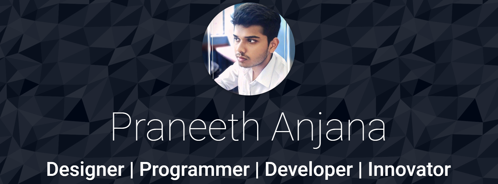

 

  

 

  

 

# My new Stats

  
<table border="0">
  <tr>    
    <td>

    </td>
    <td>
       

        
      

    </td>  
  </tr>
</table>

<tr>
     <td colspan="2" align="center">
      
    </td>
</tr>

 
 

# My Skill Set

| Title                          | Icon                                                                                                             |
|--------------------------------|------------------------------------------------------------------------------------------------------------------|
| Programming Languages          |                                              |
| Scripting Languages            |                                                              |
| Framworks & Libraries          |  |
| Mobile Application Development |                                                      |
| Tools                          |                  |
| Databases                      |                                                         |
| Version Control                |                                                     |
| Others                         |                                                      |

 
 

  

<h3 align="center">...Contact ME...</h3>

&#128383;

    

<!--  -->

  

